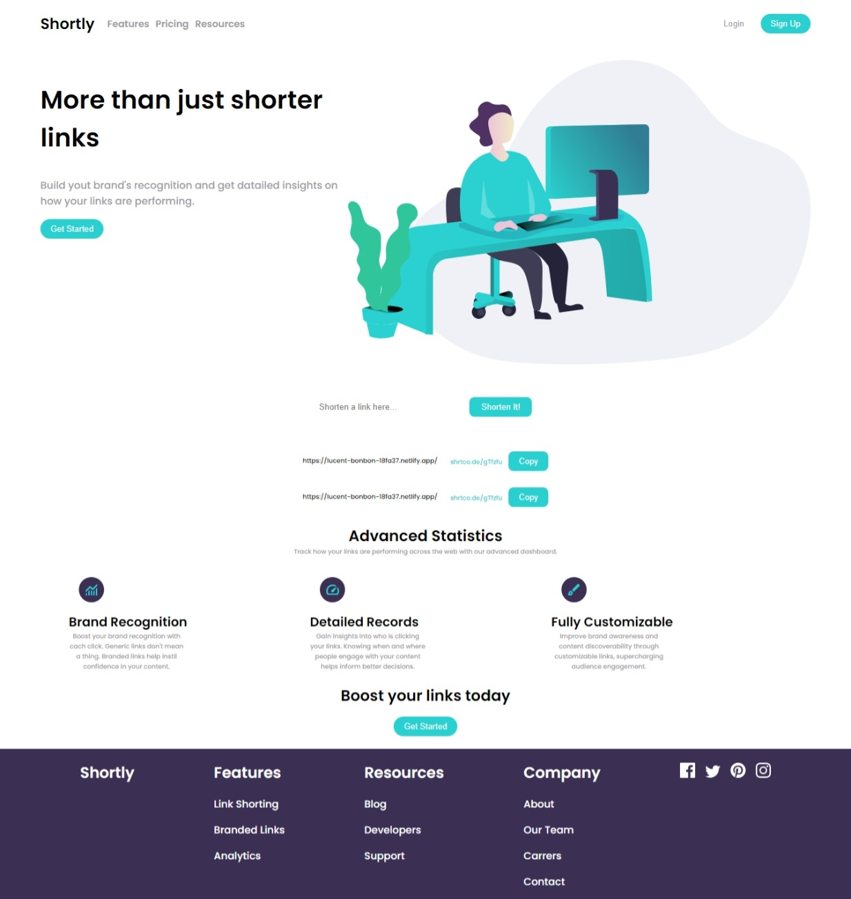

# Frontend Mentor - Shortly URL shortening API Challenge solution

This is a solution to the [Shortly URL shortening API Challenge challenge on Frontend Mentor](https://www.frontendmentor.io/challenges/url-shortening-api-landing-page-2ce3ob-G).

## Table of contents

- [Overview](#overview)
  - [The challenge](#the-challenge)
  - [Screenshot](#screenshot)
  - [Links](#links)
- [My process](#my-process)
  - [Built with](#built-with)
  - [What I learned](#what-i-learned)
  - [Continued development](#continued-development)
- [Author](#author)

## Overview

### The challenge

Users should be able to:

- View the optimal layout for the site depending on their device's screen size
- [x] Shorten any valid URL
- [x] See a list of their shortened links, even after refreshing the browser
- [x] Copy the shortened link to their clipboard in a single click
- [x] Receive an error message when the `form` is submitted if:
  - [x] The `input` field is empty

### Screenshot



**Note: Add video.**

### Links

- Solution URL: [GitHub](https://github.com/im-victor-mendez/React-URL_Shortening_API_Landing)
- Live Site URL: [Netlify](https://lucent-bonbon-18fa37.netlify.app/)

## My process

### Built with

- [React](https://reactjs.org/) - JS library
- JavaScript
- SCSS
- Semantic HTML5 markup
- CSS custom properties
- Flexbox
- CSS Grid
- Mobile-first workflow

### What I learned

- How to use the storage of the browser:
  ```js
  localStorage.getItem('itemName', value)
  ```

- How to use the svg elements:
    Returning the svg element as React component.

### Continued development

- Add the "hamburger menu" to mobile sizes.
- Add the svg background to some elements.
- Add directions to some buttons.

## Author

- LinkedIn - [in/im-victor-mendez](https://www.linkedin.com/in/im-victor-mendez/)
- GitHub - [@im-victor-mendez](https://github.com/im-victor-mendez)
- Frontend Mentor - [@im-victor-mendez](https://www.frontendmentor.io/profile/im-victor-mendez)